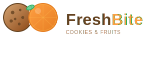

# FreshBite Logo Guide

## 📋 Overview

This document explains the FreshBite Cookies & Fruits logo system and how to use it correctly.

## 🎨 Logo Variations

### 1. **Main Logo (Horizontal)**
- **File**: `logo.svg`
- **Use**: Website header, business card, letterhead, presentations
- **Aspect Ratio**: Horizontal (wide format)
- **Dimensions**: 300 × 120 pixels (ideally scale proportionally)
- **Best For**: Desktop display, wide formats

### 2. **Icon Logo (Square)**
- **File**: `logo-icon.svg`
- **Use**: Favicon, app icon, social media profile, small spaces
- **Aspect Ratio**: Square (1:1)
- **Dimensions**: 100 × 100 pixels (ideally scale proportionally)
- **Best For**: Small formats, favicons, app icons

## 🎯 Logo Design Elements

### Components
- **Cookie** (Left) - Brown cookie with chocolate chips and a bite mark
- **Orange** (Right) - Gradient orange with segment details
- **Leaf** (Center) - Green connecting element representing freshness
- **Text** - "FreshBite" with "Bite" highlighted in orange
- **Tagline** - "COOKIES & FRUITS" in smaller text

### Colors Used
```
Primary Brown:  #8B4513 (Brown - Cookie & Text)
Primary Orange: #FF9F43 (Orange - Fruit & Accent)
Primary Green:  #6FCF97 (Green - Leaf & Fresh feel)
Light Tan:      #D4A574 (Cookie highlight)
Dark Brown:     #654321 (Shadows & Details)
```

### Typography
- **Font**: Arial (or similar clean sans-serif)
- **Weight**: Bold (700) for main text
- **Color**: Brown (#654321) for "Fresh" + Orange (#FF9F43) for "Bite"
- **Tagline**: Smaller, gray-brown color for supporting text

## 📐 Sizing Guidelines

### Logo Sizes
| Use Case | Minimum Width | Recommended |
|----------|--------------|-------------|
| Website Header | 150px | 250-300px |
| Business Card | 80px | 100-150px |
| Favicon | 32px | 64-128px |
| Social Media Avatar | 64px | 256px-1024px |
| App Icon | 64px | 512px-1024px |
| Print (Large Format) | 2 inches | 3-4 inches |

## 🚀 Website Implementation

The logo is already integrated into all website pages:
- `index.html` - Homepage
- `products.html` - Products page
- `product-detail.html` - Product details
- `cart.html` - Shopping cart
- `checkout.html` - Checkout page
- `contact.html` - Contact page

### CSS Styling
```css
.logo img {
  height: 50px;
  width: auto;
  display: block;
}

.logo:hover {
  transform: scale(1.05);
}
```

## 💫 Logo Characteristics

### Strengths
✅ **Modern** - Clean, contemporary design
✅ **Memorable** - Distinctive cookie + fruit combination
✅ **Versatile** - Works in color and can be adapted for B&W
✅ **Scalable** - SVG format means perfect quality at any size
✅ **Professional** - Warm colors convey freshness and quality
✅ **Recognizable** - Clear visual identity for the brand

### Symbolism
- **Cookie** - Represents the baked goods/quality craftsmanship
- **Fruit** - Represents freshness, natural ingredients, health
- **Leaf** - Represents organic, natural, and eco-friendly values
- **Warm Colors** - Convey warmth, friendliness, and invitation
- **Bite Mark** - Shows enjoyment and consumption

## 📱 Digital Usage

### Favicon
Use `logo-icon.svg` converted to ICO format:
```html
<link rel="icon" type="image/svg+xml" href="logo-icon.svg">
```

### Social Media
- **Profile Picture**: Use `logo-icon.svg` (square format)
- **Recommended Size**: 1024 × 1024px or higher
- **Platforms**: Facebook, Instagram, Twitter, WhatsApp

### Website
- **Header Logo**: `logo.svg` at 200-300px width
- **Favicon**: `logo-icon.svg` at 32-64px
- **Footer Logo**: Optional, `logo-icon.svg` at 80-100px

### Email Signature
```html

```

## 🎨 Color Variations

### Full Color (Default)
- **When to Use**: All digital and most print applications
- **Background**: Works on white and light backgrounds
- **File**: `logo.svg` or `logo-icon.svg`

### One Color (Brown)
- **When to Use**: Embroidery, stamping, monochrome printing
- **Color**: #8B4513 (Primary Brown)
- **Use Case**: Business forms, official documents

### One Color (White)
- **When to Use**: Dark backgrounds, inverse applications
- **Color**: White (#FFFFFF)
- **Background**: Brown or primary color backgrounds

## ✋ What NOT to Do

❌ Don't distort the logo (maintain aspect ratio)
❌ Don't rotate the logo
❌ Don't change the colors (maintain color integrity)
❌ Don't add drop shadows or gradients not in original
❌ Don't place on clashing background colors
❌ Don't use the logo smaller than minimum sizes
❌ Don't combine with other competing logos
❌ Don't apply effects like blur or transparency arbitrarily

## 📏 Clear Space

Maintain clear space around the logo:
- **Minimum Clear Space**: 10px (or 10% of logo width)
- **Meaning**: No text, graphics, or other elements within this space
- **Purpose**: Ensures logo clarity and visual impact

## 🖨️ Print Specifications

### Business Card
- **Logo Size**: 25mm × 10mm (horizontal variant)
- **Color Mode**: CMYK
- **Resolution**: 300 DPI minimum

### Letterhead
- **Logo Size**: 40mm × 16mm (horizontal variant)
- **Position**: Top left or top center
- **Color Mode**: CMYK
- **Resolution**: 300 DPI minimum

### T-Shirt/Merchandise
- **Size**: 3-4 inches wide
- **Format**: Convert SVG to PDF for embroidery
- **Colors**: Use primary colors for impact

## 🔄 File Formats

### Current Files
- **logo.svg** - Main horizontal logo (scalable vector)
- **logo-icon.svg** - Square icon version (scalable vector)

### Future Conversions (If Needed)
- **logo.png** - Raster format (for web fallback)
- **logo.ico** - Favicon format (for browser tab)
- **logo.pdf** - Print format (with CMYK colors)

### How to Convert
1. SVG → PNG: Use Inkscape or ImageMagick
2. SVG → ICO: Use online favicon generators
3. SVG → PDF: Use Illustrator or Inkscape

## 👥 Usage Examples

### ✅ Correct Usage
- Logo centered on website header
- Logo at appropriate size for context
- Logo with adequate white space around it
- Logo on neutral or contrasting background
- Logo with consistent color scheme

### ❌ Incorrect Usage
- Logo stretched or distorted
- Logo overlapping with text
- Logo with no clear space
- Logo on confusing background
- Logo with altered colors

## 📞 Questions?

For logo-related questions or further customization needs:
- **Email**: info@freshbite.co.ke
- **WhatsApp**: +254 700 000 000

---

**Logo Version**: 1.0  
**Created**: April 5, 2026  
**© FreshBite Cookies & Fruits - All Rights Reserved**
